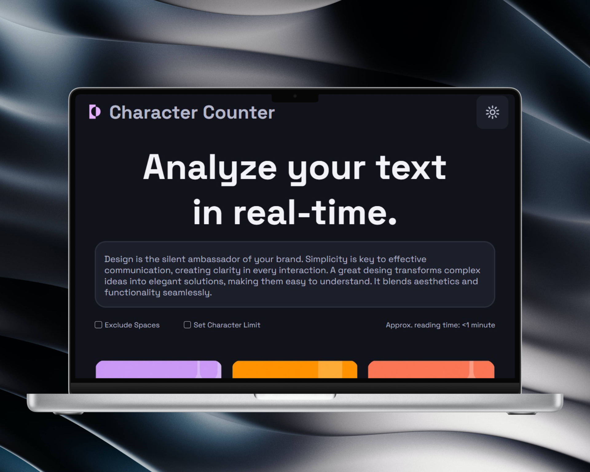
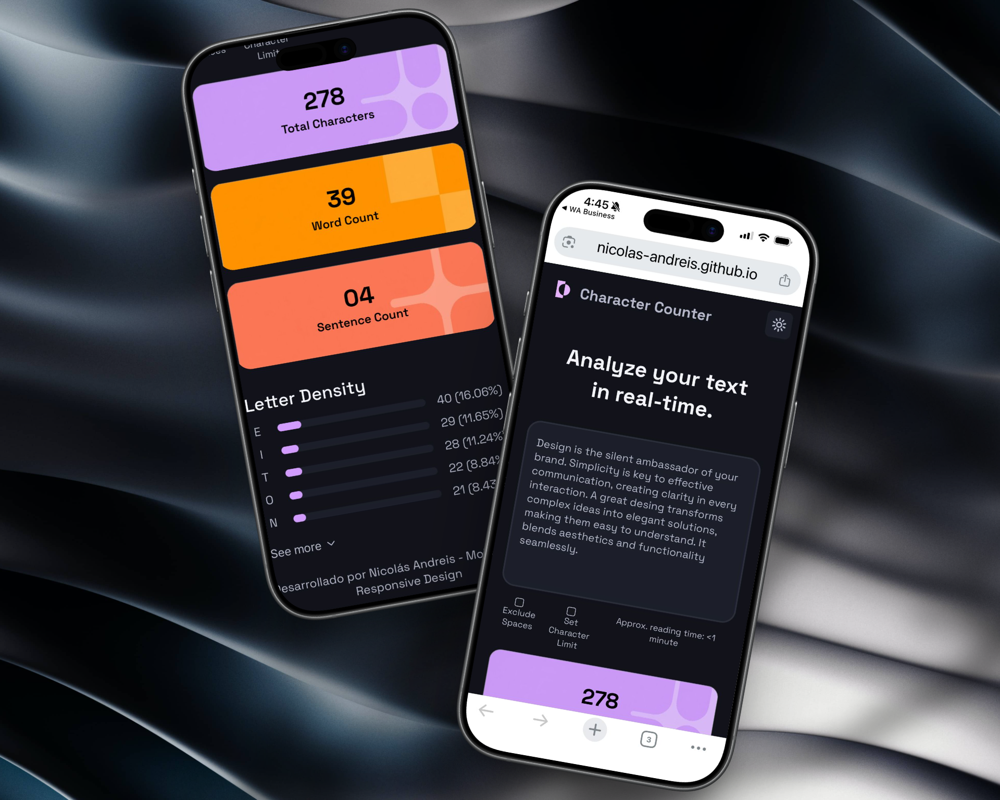

# Character Counter — Aplicación de análisis de texto


## Objetivo del proyecto

Desarrollar una aplicación funcional de conteo y análisis de texto con **React**. La interfaz procesa en tiempo real el contenido ingresado por el usuario y muestra estadísticas de caracteres, palabras, oraciones, tiempo estimado de lectura y densidad de letras.

Este proyecto continúa la primera etapa de maquetado estático realizada con HTML y CSS, incorporando ahora componentes reutilizables, estado, eventos y renderizado dinámico.

## Tecnologías utilizadas

- **React 19** — componentes, estado, eventos, renderizado condicional y Context API.
- **JavaScript (ES Modules)** — lógica para procesar y analizar el texto.
- **CSS3** — variables CSS, Flexbox, Grid, animaciones y diseño responsive.
- **Vite** — entorno de desarrollo y herramienta de compilación.
- **Local Storage** — persistencia de la preferencia de tema.
- **Google Fonts** — [Space Grotesk](https://fonts.google.com/specimen/Space+Grotesk).

## Funcionalidades

- Conteo de caracteres en tiempo real.
- Conteo de palabras y oraciones.
- Opción para excluir los espacios del conteo de caracteres.
- Límite de caracteres configurable.
- Aplicación del límite al presionar `Enter` o al salir del campo.
- Cálculo aproximado del tiempo de lectura a partir de 200 palabras por minuto.
- Cálculo automático de la frecuencia y el porcentaje de cada letra.
- Separación de letras principales y secundarias según un umbral del 5 %.
- Sección desplegable **See more** para consultar las letras menos frecuentes.
- Desplazamiento suave al abrir el detalle de densidad.
- Alternancia entre tema claro y oscuro.
- Persistencia del tema seleccionado mediante `localStorage`.
- Diseño responsive para mobile, tablet y desktop.

## Organización de la aplicación

La aplicación se divide en componentes con responsabilidades específicas:

1. **`App`** — administra el texto y el estado general; calcula caracteres, palabras, oraciones, tiempo de lectura y densidad de letras.
2. **`Header`** — muestra la identidad del sitio y el botón para cambiar de tema.
3. **`WriteArea`** — textarea controlado donde se ingresa el texto.
4. **`Controls`** — contiene las opciones para excluir espacios y establecer un límite de caracteres.
5. **`ReadingTime`** — presenta el tiempo aproximado de lectura.
6. **`Stats`** — agrupa las tres métricas principales.
7. **`Card`** — componente reutilizable para representar cada métrica.
8. **`LetterDensity`** — genera las barras de frecuencia y permite desplegar las letras menos utilizadas.
9. **`ThemeContext`** — comparte el tema entre componentes y conserva la elección del usuario.

## Cómo se resolvió la lógica

- **Caracteres** — se utiliza la longitud del texto; si está activa la opción correspondiente, primero se eliminan los espacios en blanco.
- **Palabras** — el texto se limpia en los extremos y se divide por uno o más espacios.
- **Oraciones** — se separan utilizando `.`, `?` y `!` como delimitadores.
- **Tiempo de lectura** — se divide la cantidad de palabras por un promedio de 200 palabras por minuto.
- **Límite de caracteres** — se aplica `maxLength` al textarea y, si el límite se reduce, el contenido se recorta al confirmar el nuevo valor.
- **Densidad de letras** — el texto se convierte a minúsculas, se eliminan los caracteres que no son letras y se calcula la frecuencia porcentual de cada una.
- **Tema** — Context API centraliza el estado del tema y `localStorage` conserva la selección entre sesiones.

## Estilos y responsive

- Variables CSS para tipografía, colores, bordes, espaciados, sombras y transiciones.
- Estilos globales separados del reset y de los estilos propios de cada componente.
- Flexbox y Grid para distribuir controles, tarjetas y filas de densidad.
- Barras de progreso con ancho dinámico calculado desde React.
- Checkboxes personalizados y estados visuales para los controles.
- Animación al mostrar las letras secundarias y rotación del indicador de **See more**.
- Media queries con puntos de quiebre para tablet y desktop.

## Instalación y ejecución

Requisitos: [Node.js](https://nodejs.org/) y npm.

```bash
git clone https://github.com/Nicolas-Andreis/character-counter-react.git
cd character-counter-react
npm install
npm run dev
```

Para generar la versión de producción:

```bash
npm run build
```

## Capturas del resultado

### Desktop




### Tablet


### Mobile



## Estructura de carpetas

```text
character-counter/
├── public/
│   ├── favicon.svg
│   └── icons.svg
├── src/
│   ├── assets/
│   │   ├── icons/
│   │   │   ├── down_arrow.svg
│   │   │   └── light.svg
│   │   ├── images/
│   │   │   └── cards/
│   │   │       ├── orange_card.png
│   │   │       ├── violet_card.png
│   │   │       └── yellow_card.png
│   │   ├── logo/
│   │   │   └── logo.png
│   │   └── mockups/
│   │       ├── desktop1.png
│   │       ├── desktop2.png
│   │       ├── marketing.png
│   │       ├── smartphone.png
│   │       └── tablet.png
│   ├── components/
│   │   ├── Card/
│   │   ├── Controls/
│   │   ├── Header/
│   │   ├── LetterDensity/
│   │   ├── ReadingTime/
│   │   ├── Stats/
│   │   └── WriteArea/
│   ├── context/
│   │   └── ThemeContext.jsx
│   ├── styles/
│   │   ├── globals.css
│   │   ├── reset.css
│   │   └── variables.css
│   ├── App.css
│   ├── App.jsx
│   ├── index.css
│   └── main.jsx
├── .gitignore
├── eslint.config.js
├── index.html
├── package.json
├── package-lock.json
├── vite.config.js
└── README.md
```

Cada carpeta de `components` contiene el archivo JSX del componente y su hoja de estilos CSS correspondiente.

## Posibles mejoras

- Ordenar la densidad de letras de mayor a menor frecuencia.
- Añadir pruebas unitarias para los cálculos de texto.
- Incorporar mensajes de validación para el límite de caracteres.
- Mejorar la accesibilidad del selector de tema y de los controles.
- Configurar el despliegue de producción.
